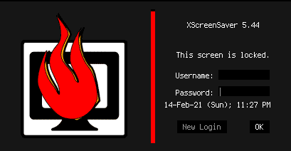

# XScreenSaver OverDark Theme
  

## Deprecated
With the release of [XScreenSaver v6.0.0](https://www.jwz.org/xscreensaver/changelog.html) custom themes have been implemented, including borderless-black, similar to XScreenSaver-OverDark. As such, this repo will be archived.

## Description
A dark theme for XScreenSaver based on a [2011 Ask Ubuntu answer](https://askubuntu.com/a/85196).

## Screenshots

## Installation (before v6.0.0)
1. Install the `terminus` font
2. Execute `curl 'https://gitlab.com/Atrate/xscreensaver-overdark-theme/-/raw/master/.Xresources' >> ~/.Xresources && xrdb -merge ~/.Xresources`
3. Restart XScreenSaver: `killall xscreensaver && xscreensaver &`

## Uninstalation
1. Remove the lines for the theme from `~/.Xresources`
2. Restart `X` (log out and log in/restart computer)

## Credits
- `fossfreedom` for their [Ask Ubuntu answer](https://askubuntu.com/a/85196).

## License
This project is licensed under the [GPL-3.0-or-later](https://www.gnu.org/licenses/gpl-3.0.html).
